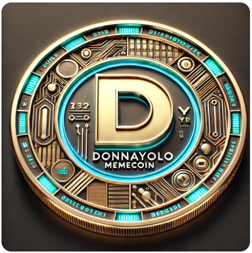

# DonnaYolo (DONYO): The Memecoin That Lives Boldly
- Symbol: DONYO
- Blockchain: Kava
- Total Supply: 1,000,000,000 DONYO

- Website: soon
- Whitepaper: soon

# Introduction
Welcome to DonnaYolo (DONYO)—the memecoin that celebrates breaking free from conformity and living life to the fullest. DonnaYolo isn’t just another meme-based crypto project, it’s a lifestyle, a mindset, and a movement.

Inspired by the Italian concept of "donnaiolo" a confident, trend-setting individual who refuses to follow societal norms and combined with the YOLO philosophy of You Only Live Once, DONYO embodies independence, boldness, and risk-taking.

Whether you're an early crypto adopter, a trendsetter in your community, or someone who embraces living freely, DonnaYolo is the coin that lets you be yourself and live boldly in the world of crypto.

# Key Features
1. YOLO Philosophy in Action
At the heart of DonnaYolo is the idea of living fearlessly and taking risks. Like the YOLO mindset, DONYO is about seizing opportunities, breaking away from trends, and living in the moment—whether in crypto trading or real life.

2. Free Thinker’s Tokenomics
DONYO’s tokenomics are designed to reward those who take bold actions:

  - 40% Airdrop to Early Supporters: Early believers in the project who help build the community will be rewarded with a large airdrop, aligning with the YOLO mindset of seizing opportunities.
  - 20% Liquidity Pool: Ensures smooth and high-volume trading on decentralized exchanges, making it accessible for everyone, from risk-takers to cautious investors.
  - 10% Staking Rewards: Holders who stake their DONYO tokens will be rewarded with high returns, incentivizing long-term belief in the project and embracing the philosophy of long-term risk and reward.
  - 2% Trendsetter Tax: A unique mechanism that redistributes tokens from every transaction to loyal holders, while burning a portion of each transaction to increase token scarcity.
3. Trendsetter DAO Governance
DonnaYolo is more than just a token—it’s a community-led movement. Through the Trendsetter DAO, holders of DONYO will shape the future of the project. They’ll vote on key decisions like partnerships, product features, and which charities to support, ensuring that DonnaYolo is constantly evolving with its community.

4. High-Risk, High-Reward Lottery
Every month, one lucky wallet holding DONYO tokens for at least 30 days is selected for a YOLO jackpot. This lottery rewards those bold enough to hold and believe in the project, with chances to win huge rewards.

# The DonnaYolo Mascot: Bold, Trend-Setting, Unapologetic
Meet the DonnaYolo Mascot, a stylish figure that embodies the bold, free-thinking ethos of the project. Whether it’s the charming human version of donnaiolo or the sleek animal mascot (a confident, sleek fox known for cleverness and independence), the DonnaYolo mascot captures the spirit of the project—someone who sets trends, not follows them.

These mascots not only represent the brand but will also be featured in limited edition NFTs, available to early adopters and trendsetters.

# The YOLO Lifestyle
DonnaYolo isn’t just a coin—it’s a way of life.

With DONYO, you’re not just investing in a crypto token; you’re investing in a culture of non-conformity, creativity, and living with boldness. From the vibrant meme culture surrounding the token to the community-driven decisions about its future, every element of DonnaYolo embodies risk-taking, freedom, and independence.

# Real-World Utility:
DONYO will soon partner with extreme sports companies, travel brands, and lifestyle influencers to offer real-world uses for the coin. Whether it’s paying for skydiving experiences, attending music festivals, or purchasing exclusive merch, DONYO will integrate into the lives of its holders, providing utility beyond the crypto space.

# Community-Driven Success
At the core of DonnaYolo’s mission is its community—a group of free thinkers, risk-takers, and non-conformists who want to create a decentralized, YOLO-inspired movement.

- Reddit: A lively space for discussions, stories of bold risk-taking, and crypto market analysis.
- Telegram: Daily discussions, market trends, and community challenges to win DONYO.
- Discord: A place for more technical discussions, partnerships, and sneak peeks at upcoming NFT drops.
- The YOLO and donnaiolo spirit is alive in these communities, with each member contributing to the larger movement.

# Why Invest in DONYO?
- Unique Branding: A combination of YOLO and donnaiolo ensures that DonnaYolo stands out in the crowded memecoin space with a fresh, original concept.
- Strong Community: DonnaYolo is not just about making money—it's about creating a culture of freedom, independence, and boldness.
- Long-Term Vision: With DAO governance, NFT collections, and real-world use cases, DONYO has a roadmap for sustained growth and innovation.
- High Reward Potential: From staking programs to lotteries and unique airdrops, there are many ways to win big with DONYO.
- 
# Moonshot Potential
With its strong community focus, innovative tokenomics, and real-world applications, DonnaYolo has the potential to become the next big memecoin sensation. This project is designed not just to ride trends but to set them.

Join DonnaYolo today — because You Only Live Once, and it's time to start living boldly!

# Start Living the DonnaYolo Way
- Website: soon
- Telegram: soon
- Discord: soon
